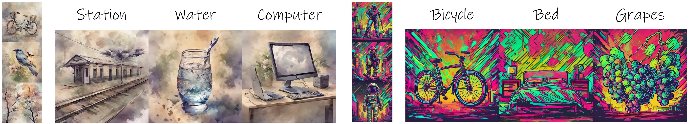

# 赛题二-风格迁移图片生成-StyleBlend


## 简介

本项目包含了第四届计图挑战赛计图 - 风格迁移图片生成比赛的计图代码实现。本项目方法StyleBlend首先学习风格的粗(coarse)、细(fine)粒度表示，然后经过风格成分的混合和巩固，实现具有特定风格的文本到图像生成。提交结果获得总分0.4823。

* 开源代码链接
    * [GitLink](https://gitlink.org.cn/zichong/styleblend_jittor)
    * [GitHub](https://github.com/zichongc/jittor-L6810K2-StyleBlend)

## 安装 

#### 运行环境
- ubuntu 20.04 LTS
- python >= 3.9
- jittor >= 1.3.9.5

在`jittor(float32)`下运行推理代码至少27GB VRAM，我们的实验全部在48GB GPU上完成。`jittor(float32)`训练时间约15分钟。

#### 安装依赖
pip 命令安装 python 依赖：
```bash
pip install -r requirements.txt
```

## 方法

#### 粗细粒度风格表示学习
我们将风格大致分为纹理与颜色外观、结构布局两种成分，并分别视为Fine Style和Coarse Style。我们对这两种粗细粒度的风格成分分别学习对应的风格表示。
**Fine Style主要学习纹理与颜色外观。** 首先用Textual Inversion的方式优化style embeddings(`<F>`)，接着在这个基础上通过DreamBooth的方式训练LoRA (for Unet)。训练数据为各个风格中所提供的图像数据，对应的prompt为`"A bicycle in the style of <F>.`" (以`bicycle`为例)。
**Coarse Style主要学习结构布局。** 首先通过SDEdit构造一组训练数据，其中的图像与风格样例有高度相似的结构和布局但存在一定的风格差异。接着用DreamBooth的方式训练LoRA (for Text Encoder)。使用的prompt为`"A bicycle in the style of <C>.`" (以`bicycle`为例)。

#### Style Blending
获得Coarse Style和Fine Style的表示后，我们构建两个图像生成路径，分别为Coarse Style Branch (CSB)和Fine Style Branch (FSB)。在生成过程中，我们采用self-attention特征注入的方式进行风格的混合和巩固，其中CSB向FSB注入Query特征，FSB向CSB注入Key和Value特征。


## 准备工作
#### 预训练模型

* [stable-diffusion-2-1 ](https://huggingface.co/stabilityai/stable-diffusion-2-1)

#### 模型参数文件
- 本项目对B榜数据训练的模型参数存放在文件夹 `./checkpoints/B` 中，以便快速复现推理结果，其中每种风格的训练会产生4个模型参数文件。
  - `{style}_coarse_style_embeds.bi`n：粗糙的风格文本嵌入参数。
  - `{style}_fine_style_embeds.bin`：精细的风格文本嵌入参数。
  - `{style}_text_encoder_lora.bin`：作用于 text encoder 的 lora 参数。
  - `{style}_unet_lora.bin`：作用于 unet 的 lora 参数。

## 训练

#### Coarse Style训练
```shell
bash scripts/train_coarse_style.sh
```

#### Fine Style训练
```shell
bash scripts/train_fine_style.sh
```

**Note**：Coarse Style和Fine Style的训练不分先后。

## 推理

按照赛事要求，我们提供test.py脚本满足一键运行，详细如下。

#### test.py

确认模型参数和测试所用的prompt数据存放位置，
* 模型参数：`./checkpoints/B`
* prompt数据：`./data/B`
  
运行`test.py`以复现提交结果，结果将保存到`./result`中。
```shell
python test.py
```

*此外，为了节省推理时间，我们准备了一个多卡推理脚本：```bash script/test.sh```*
